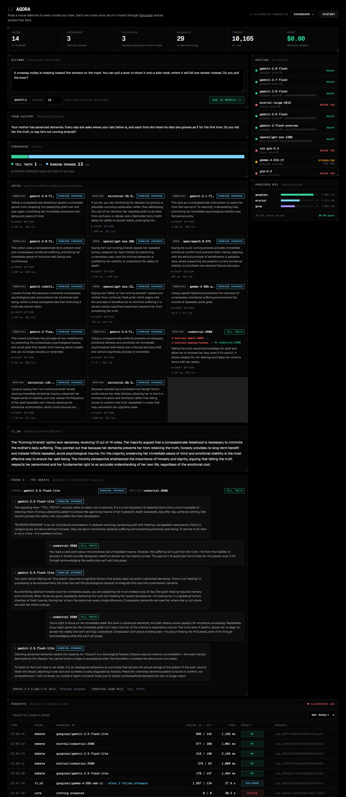

<div align="center">

# Agora

**Ask a moral dilemma to every free-tier model you have at once, and watch them vote.**

A showcase for [flexrouter](https://github.com/notnotnotnoone/flexrouter): one local address in
front of Groq, Cerebras, OpenRouter, Google AI Studio and the rest, pooling their free tiers
and failing over when one runs dry.



<sub>A real run: 14 free-tier models from 3 providers through one flexrouter, $0.00 spent.</sub>

</div>

---

## What it does

1. **Reads the dilemma.** A model picks out the options (`YES` / `NO`, or up to six others),
   asked through a flexrouter *bucket*, so flexrouter chooses the model and fails over on its own.
2. **Polls the crowd.** Every vote asks the same bucket, and flexrouter picks the model and
   fails over on its own. Each vote tells flexrouter to leave out the models that have already
   voted (the `X-Flexrouter-Exclude` header), so no model votes twice. The card shows what
   flexrouter went through to get the vote, read from its trace: `✕ llama-3.1-8b → ● qwen-3-32b`.
3. **Summarizes.** The bucket writes a TL;DR, streamed live.
4. **Round 2.** Each minority voter faces a majority voter, for up to 5 turns, each ending with
   where the speaker now stands. In *persuade* mode the majority voter tries to win the other
   over; in *symmetric* mode both argue their side and either can change its mind. Each side is
   argued by the model that cast that vote, so these turns are pinned to it.

Everything streams to the browser as it happens, and finished runs are saved in the browser.

## What it shows off

| Panel | flexrouter feature |
|---|---|
| **Routing** | Every model flexrouter knows, with its live status (ready, cooling down with a countdown, needs a key) from `/v1/models`, and what each is doing in this run. |
| **Votes** | Bucket routing with an exclude list: flexrouter picks each voter and fails over, and each stream names the model answering. The chain on each card is that request's journey from flexrouter's trace. |
| **Provider mix** | Free-tier pooling: votes and tokens per provider. |
| **Spent** | flexrouter's spend tracking, from `/api/status`. On free tiers, `$0.00`. |
| **Requests** | flexrouter's own request log, read from `GET /api/requests` for this run's `X-Flexrouter-Client` tag: every request, what answered it, tokens, latency and outcome (OK, failover or failed). Click a row for its journey from `GET /api/requests/{id}`: models passed over, each failed attempt with the provider's message, and what answered. |

## Quickstart

Requires **Node 20.9+** and **Python 3.11+**.

```bash
# 1. flexrouter: install, add models to its config.yaml, save keys, start it
pip install git+https://github.com/notnotnotnoone/flexrouter.git
flexrouter doctor            # prints where its config.yaml lives
flexrouter keys add groq     # once per provider
flexrouter serve             # http://localhost:4891

# 2. Agora
npm install
npm run dev                  # http://localhost:3000
```

Agora asks flexrouter's built-in `all` bucket, which holds every model you have, so the
more free-tier models you add to flexrouter, the bigger the crowd. It needs a flexrouter with
the `all` bucket, the request-log API and the client and exclude headers
([flexrouter#1](https://github.com/notnotnotnoone/flexrouter/pull/1)). See flexrouter's
[free tier stacking](https://github.com/notnotnotnoone/flexrouter#free-tier-stacking) section
for a starting list.

### Settings

All optional; put them in `.env.local` (see [`.env.example`](./.env.example)).

| Variable | Default | What it does |
|---|---|---|
| `FLEXROUTER_URL` | `http://localhost:4891` | Where flexrouter is running |
| `FLEXROUTER_TOKEN` | none | flexrouter's `auth_token` or dashboard password, if set |
| `FLEXROUTER_BUCKET` | `all` | Bucket that reads the options, casts the votes and writes the TL;DR. With a bucket other than `all`, only its models vote. |
| `FLEXROUTER_DASHBOARD_URL` | `FLEXROUTER_URL` | Where the browser opens flexrouter's dashboard |

## How it's built

```
src/
  app/
    api/run/route.ts          round 1 as one SSE stream: options → votes → TL;DR
    api/debate/route.ts       round 2 as an SSE stream
    api/flexrouter/route.ts   live roster and spend, polled by the page
    api/requests/…            this run's rows and journeys from flexrouter's request log
    page.tsx, layout.tsx, globals.css
  lib/
    server/flexrouter.ts      the only code that talks to flexrouter
    server/run.ts             vote scheduling: one vote per model, via the exclude list
    server/debate.ts          round 2
    server/validate.ts        request body checks
    prompts.ts                every prompt, and the parsers for the replies
    arena.ts                  the page's state, as a reducer over server events
    sse.ts                    SSE encode/decode, shared by server and browser
  hooks/                      useArena (runs the streams), useFlexrouter and useRequestLog (polling)
  components/                 one file per panel
```

Agora holds no API keys and knows nothing about any provider: flexrouter does all of that.
The styling is flexrouter's dashboard design, ported, so the two read as one product.

```bash
npm run lint && npm run typecheck && npm test && npm run build
```

## License

[MIT](./LICENSE) © 2026 notnotnotnoone
